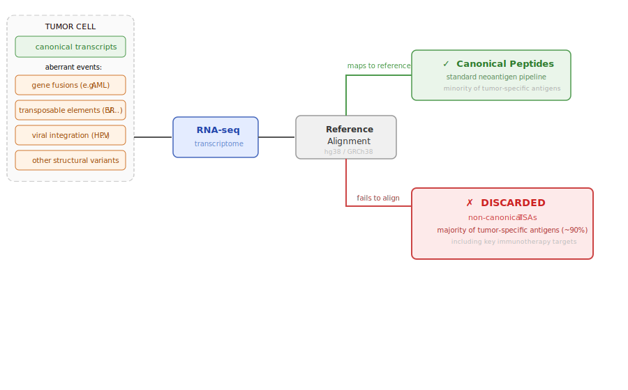
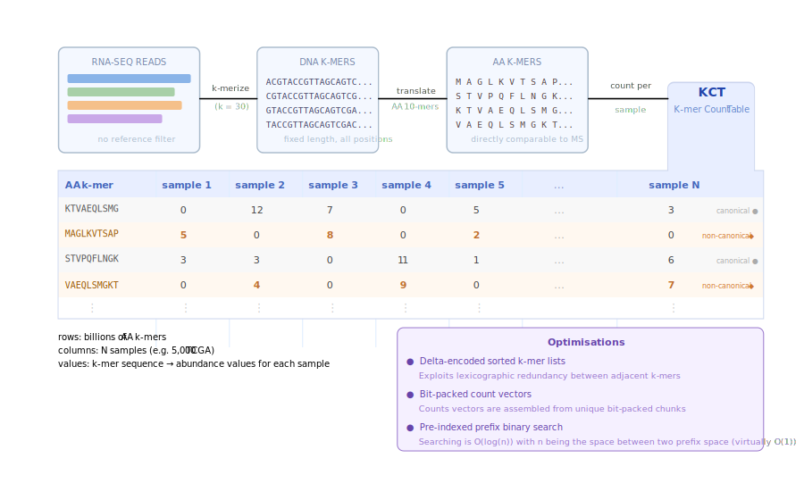
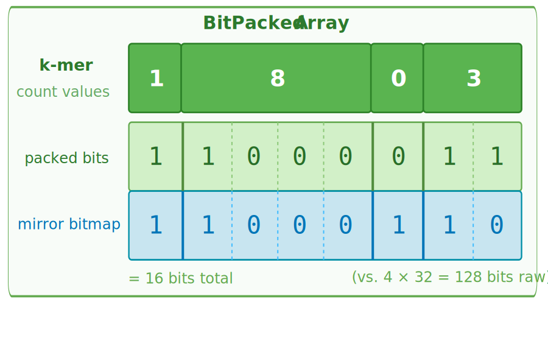
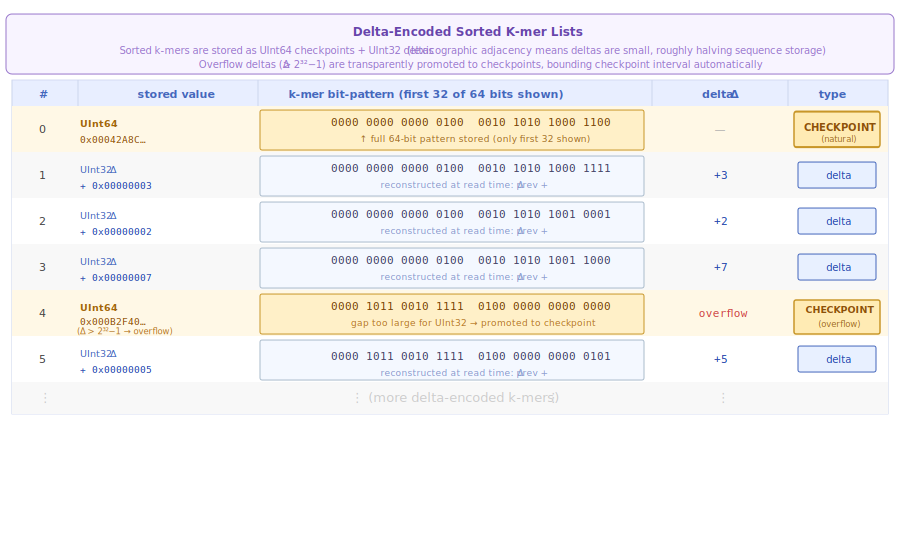

# NeoKCT
 
**Neo K-mer Count Table** a reference-free, memory-efficient framework for transcriptomic profiling at scale.
 
---
 
## Motivation
 
Reference-based analyses discard non-aligning reads, overlooking biologically important elements such as alternative open reading frames and aberrantly expressed tumor-specific antigens (aeTSAs). Systematic discovery of these sequences requires reference-free methods that scale to modern transcriptomic datasets comprising hundreds to thousands of RNA-Seq samples.
 
NeoKCT is built around a memory-efficient k-mer count table that holds billions of k-mers and their per-sample counts simultaneously, supports parallel traversal across large sample cohorts, and enables rapid reconstruction of transcriptomic profiles. By joining a table of sequenced aeTSA peptides with a table of RNA-Seq samples, one can find the origin of each peptide across thousands of samples entirely without reference alignment, enabling unbiased discovery of non-canonical transcripts for immunopeptidomics and transcriptomics applications.


 
---
 
## How It Works
 
```
RNA-Seq FASTQ files
        │
        ▼
  k-merize + count  (JelloFish.jl parallel, per-chunk)
        │  DNA k-mers → amino acid k-mers (5-bit encoding)
        ▼
  per-sample hash table
        │
        ▼
  push into NeoKCT  (NeoKCT.jl)
        │  CSR layout, bit-packed counts, prefix-indexed binary search
        ▼
  multi-sample KCT  → query / join / serialize
        │
        ▼ (optional enrichment)
  add_biotypes(kct, gidx)  (RichKCT.jl)
        │  O(n+m) sorted merge walk against GenomicIndex
        ▼
  RichKCT  → per-k-mer counts + biotype bitmask


Ensembl transcript FASTA + GTF / GFF3
        │
        ▼
  build_genomic_index  (GenomicIndexBuilder.jl)
        │  k-merize transcripts, OR-accumulate biotype bits per k-mer
        ▼
  GenomicIndex  (sorted k-mers, deduplicated bitmask pool, prefix index)
```
 
Each sample is processed into a k-mer count hash table, then merged into a single `NeoKCT` data structure that grows incrementally. The table can be periodically collapsed (deduplication of count words) and saved to disk in a versioned binary format.


 
---
 
## Key Technical Features
 
- **Bit-packed count storage** (`PackedArray`): variable-width values packed into fixed-size words, dramatically reducing memory footprint compared to standard arrays. Implements `AbstractVector{Vector{T}}`.

  
- **Delta-encoded k-mer sequences** (`DeltaArray`): sorted k-mer bit-patterns stored as delta-encoded integers (UInt64 values, UInt32 deltas), roughly halving sequence storage. Periodic checkpoints bound random access to O(checkpoint interval); sequential iteration is O(1) amortized. Overflow deltas are transparently promoted to checkpoints.

  
- **Compressed Sparse Row (CSR) layout**: k-mer sequences, per-k-mer CID counts (`n_cids`, reconstructed by cumulative sum), and count word IDs are stored in three flat vectors, minimizing per-entry allocation overhead.
- **Prefix-indexed binary search**: a 4-symbol prefix index partitions the sorted k-mer list into buckets, accelerating lookup. Within each bucket, `DeltaArray.searchfirst` performs an efficient in-order scan without full decode.
- **Parallel k-merization**: multi-threaded chunk-based processing of FASTQ files with parallel hash-table merging (`jello_superthreaded_hash`).
- **Parallel merge-sort**: task-based divide-and-conquer sort used when integrating new samples into the table.
- **DNA → amino acid translation**: nucleotide k-mers are translated to amino acid k-mers using a custom 5-bit alphabet, enabling peptide-level queries.
- **Biotype annotation layer** (`GenomicIndex` / `BiotypLayer` / `RichKCT`): an Ensembl transcript FASTA and a GTF or GFF3 annotation are k-merized into a `GenomicIndex` — a sorted table of amino-acid k-mers, each tagged with a bitmask whose bits flag which transcript biotypes (protein-coding, lncRNA, …) cover that k-mer. Multiple biotypes for the same k-mer are OR-accumulated. Calling `add_biotypes(kct, gidx)` performs an O(n+m) sorted merge walk and wraps the result in a `RichKCT`, which exposes `counts + biotype_mask` per k-mer. K-mers absent from the reference receive an intergenic mask. Biotype bitmasks are deduplicated in a compact pool (`BiotypLayer`), keeping memory overhead minimal even for large cohorts.
- **Versioned binary serialization**: tables are written/read in a compact binary format (NeoKCT: current v1.4, v1.2/v1.3 loaded with in-memory upgrade; RichKCT: v2.0; GenomicIndex: v1.0) with metadata headers.
 
---
 
## Requirements
 
- **Julia** 1.12+
 
Key dependencies (see `Project.toml`):
 
| Package | Purpose |
|---|---|
| `BioSequences` / `BioSymbols` | Biological sequence types |
| `Kmers` | K-mer representation and encoding |
| `GZip` | Compressed FASTQ support |
| `EzXML` | mzid (proteomics) file parsing |
| `CairoMakie` | Benchmarking plots |
| `ProgressMeter` | Progress bars |
 
Install dependencies from the repo root:
 
```julia
using Pkg
Pkg.activate(".")
Pkg.instantiate()
```
 
---
 
## Quick Start
 
```julia
include("NeoKCT.jl")
 
# Build a KCT from a single FASTQ file (K=30, amino-acid k-mers of length 10)
kct = build_kct("sample.fastq.gz")
 
# Build from multiple samples, saving checkpoints
samples = ["s1.fastq.gz", "s2.fastq.gz", "s3.fastq.gz"]
kct = build_kct(
    samples,
    30,  # nucleotide k-mer length (must be divisible by 3)
    500_000;  # chunk size for parallel processing
    word_size = UInt128,  # bit-packing word size
    collapse_every = 5,  # deduplicate count words every N samples
    save_at_samples = [10, 50, 100],
    save_path = "output/"
)
 
# Serialize / deserialize
write_kct(kct, "my_table.kct")
kct = load_kct("my_table.kct")
 
# Index a k-mer (returns Kmer => count_vector across samples)
i = findfirst(kct, kmer_bits)
kct[i]

# Build a GenomicIndex from Ensembl transcript FASTA + annotation (GTF or GFF3)
include("GenomicIndexBuilder.jl")
gidx = build_genomic_index("Homo_sapiens.GRCh38.cdna.all.fa.gz", "Homo_sapiens.GRCh38.110.gtf.gz", 30)

# Serialize / deserialize the GenomicIndex
write_gidx(gidx, "grch38.gidx")
gidx = load_gidx("grch38.gidx")

# Enrich a KCT with biotype annotations → RichKCT
include("RichKCT.jl")
rich = add_biotypes(kct, gidx)

# Serialize / deserialize a RichKCT (write_kct / load_kct are overloaded)
write_kct(rich, "my_table.rkct")
rich = load_kct("my_table.rkct")

# Index a k-mer in a RichKCT (returns Kmer => (counts, biotype_mask))
i = findfirst(rich, kmer_bits)
rich[i]  # => kmer => (; counts, biotype)

# Query biotype membership for a given k-mer
biotype_names_for(rich.biotypes, i)   # e.g. ["protein_coding", "lncRNA"]
has_biotype(rich.biotypes, i, "protein_coding")
```
 
---
 
## Project Layout
 
| File | Description |
|---|---|
| `NeoKCT.jl` | Core `NeoKCT` struct, `build_kct`, `push!`, binary search, sort |
| `PackedArray.jl` | Bit-packed variable-width array (`AbstractVector`) and deduplication |
| `DeltaArray.jl` | Delta-encoded sorted integer array (`AbstractVector`) with checkpoints |
| `JelloFish.jl` | Parallel k-merization and counting from FASTQ |
| `AAAlphabet.jl` | Custom 5-bit amino acid alphabet for `BioSequences` |
| `KCTLoader.jl` | Binary serialization / deserialization (NeoKCT v1.4, RichKCT v2.0, GenomicIndex v1.0) |
| `KCTBenchmarker.jl` | Memory and performance benchmarking with SVG plots |
| `BioParser.jl` | Unified reader for FASTQ, gzipped FASTQ, mzid, and FASTA files |
| `parallel_sort.jl` | Task-based parallel merge-sort |
| `BiotypLayer.jl` | Deduplicated per-k-mer biotype bitmask storage (`BiotypLayer`) |
| `GenomicIndex.jl` | Sorted reference k-mer table with biotype bitmask pool and prefix index (`GenomicIndex`) |
| `GenomicIndexBuilder.jl` | `build_genomic_index`: builds a `GenomicIndex` from Ensembl transcript FASTA + GTF/GFF3 |
| `RichKCT.jl` | `RichKCT` wrapping `NeoKCT` with a `BiotypLayer`; `add_biotypes` for left-join against `GenomicIndex` |
| `Project.toml` | Julia package manifest |
 
---
 
## Stability Notice
 
This project is under active development. The data structure layout, file format, and API are subject to significant change. No stable public API is guaranteed at this stage.

