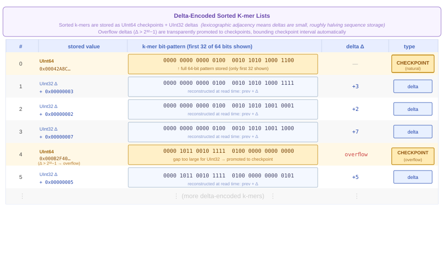

# NeoKCT
 
**Neo K-mer Count Table** is a reference-free, memory-efficient framework for transcriptomic profiling at scale.
 
---
 
## Motivation
 
Reference-based analyses discard non-aligning reads, overlooking biologically important elements such as alternative open reading frames and aberrantly expressed tumor-specific antigens (aeTSAs). Systematic discovery of these sequences requires reference-free methods that scale to modern transcriptomic datasets comprising hundreds to thousands of RNA-Seq samples.
 
NeoKCT is built around a memory-efficient k-mer count table that holds billions of k-mers and their per-sample counts simultaneously, supports parallel traversal across large sample cohorts, and enables rapid reconstruction of transcriptomic profiles. By joining a table of sequenced aeTSA peptides with a table of RNA-Seq samples, one can find the origin of each peptide across thousands of samples entirely without reference alignment, enabling unbiased discovery of non-canonical transcripts for immunopeptidomics and transcriptomics applications.

In practice this holds real cohorts: a GTEx build of 2,487 RNA-seq samples produced a table of 38.8 billion distinct amino-acid k-mers, about 686 billion present (sample, count) observations, in roughly 1.5 TB on disk, built on a single machine with peak memory well under that.


 
---
 
## How It Works

A table is built by a disk-backed streaming merge, regardless of cohort size (`build_kct_streaming`, `StreamBuild.jl`):

```
RNA-Seq FASTQ / CRAM, hundreds to thousands of samples
        │
        ▼
  count in waves  (JelloFish.jl: rolling 2-bit counter, per-sample retry)
        │  one sample's hash table in RAM at a time
        ▼
  scatter to prefix-sharded record files  (local scratch disk)
        │
        ▼
  fold each wave into a partial table  (sorted k-mers + per-shard dedup)
        │
        ▼
  hierarchical merge, interleaved with the wave loop
        │  fires every merge_fanin waves, deletes its inputs as it completes
        ▼
  streaming-transcode assembly
        │  no dedup dictionary; the packed blob streams to disk, never buffered whole
        ▼
  KCT{K, Ab, CountsLayer}  V4.0, read-only
        block-compressed sparse-count posting lists, memory-mapped on load
        │
        ▼ (optional enrichment)
  add_biotypes(kct, gidx)  (KCTLayers.jl)
        │  O(n+m) sorted merge walk against KCT{BiotypLayer}
        ▼
  KCT{CountsLayer, BiotypLayer}  → per-k-mer counts + biotype bitmask


Ensembl transcript FASTA + GTF / GFF3
        │
        ▼
  build_genomic_index  (GenomicIndexBuilder.jl)
        │  k-merize transcripts, OR-accumulate biotype bits per k-mer
        ▼
  KCT{BiotypLayer}  (sorted k-mers, deduplicated bitmask pool, prefix index)
```

Peak memory stays flat in the number of samples through counting, scattering, and merging. Only the final assembly is cohort-sized, and even it streams its output rather than holding the whole table in RAM. Waves and merge steps leave resumability markers, so a killed build picks back up without recounting finished work. See `build_kct_streaming`'s docstring in `StreamBuild.jl` for the full keyword list (`wave_size`, `shard_bits`, `merge_fanin`, `count_attempts`, `seeds`, `resume`, ...).

The resulting table is read-only: `push!`, `collapse!`, `sort!` and `repack` all raise an error on it. Add more samples by re-running `build_kct_streaming` over the full sample list (it resumes) or by seeding it from an existing table with the `seeds` keyword.


 
---
 
## Key Technical Features
 
- **Block-compressed sparse-count posting lists** (`CountsLayer`, in `KCTLayers.jl`): the representation `build_kct_streaming` produces, and the only counts representation this project uses. Each k-mer keeps its own list of the samples where it was seen, as `(sample, count)` pairs, absent samples are never stored. Sample indices within a list are gap-coded against the previous entry. K-mers are grouped into fixed blocks of 64, and each block picks a single bit width for its row lengths, its sample gaps, and its counts (the minimum that fits that block), with a short per-block exception list for counts that do not fit 16 bits. There is deliberately no cross-k-mer deduplication: measurement on real RNA-seq showed the rows holding almost all of the pairs are effectively unique, so a shared pool plus a per-k-mer pointer cost about what it saved and needed a multi-terabyte build-time dictionary to maintain. A `block_ptr` offset array gives random access to any k-mer's block without a scan. On load the packed blob is memory-mapped rather than read into RAM (`Mmap`), so resident memory is the k-mer index plus whatever blocks a query has actually touched, not the whole table. A `CountsLayer` table is read-only: `push!`, `collapse!`, `sort!`, and `repack` all raise an error on it.

  
- **Delta-encoded k-mer sequences** (`DeltaArray`): sorted k-mer bit-patterns stored as delta-encoded integers (UInt64 values, UInt32 deltas by default), roughly halving sequence storage. Periodic checkpoints bound random access to O(checkpoint interval), and sequential iteration is O(1) amortized. Overflow deltas are transparently promoted to checkpoints. Both the checkpoint type `C` and delta type `D` are type parameters, allowing compact alternatives for small tables.

  `DeltaArray` is provided by the [`NArrays`](https://github.com/lemieux-lab/NArrays) package (originally developped for this project).

  
- **Layered architecture**: a `KCT{K, Ab, Counts, Biotype, C, D}` is a wrapper combining up to three independent layers. `KmerLayer` holds the sorted k-mer sequences and prefix index. `CountsLayer` holds the count table. `BiotypLayer` holds the deduplicated biotype bitmask pool. Layers can be added or omitted independently, folding the old `NeoKCT`, `RichKCT`, and `GenomicIndex` types into one. Cross-layer operations (`add_biotypes`) are defined at the `KCT` level.
- **Prefix-indexed binary search**: an index keyed on the leading k-mer symbols (5 by default) partitions the sorted k-mer list into buckets, so a lookup jumps straight to the right bucket. Within each bucket, `DeltaArray.searchfirst` does an in-order scan without full decode.
- **Parallel k-merization**: a rolling 2-bit k-mer counter reads a chunk of sequence with no per-k-mer allocation (`count_kmers`), and `chunk_stream` fans chunks out to worker tasks behind a bounded semaphore so an unbounded backlog can't build up. `jello_superthreaded_hash` merges the per-chunk tables in parallel.
- **DNA k-mers by default, amino acid translation optional**: `JelloFish.jl`'s counter reads raw nucleotide k-mers; passing `translate=true` folds each in-frame codon to a 5-bit amino acid symbol as it goes (`K` nucleotides become `K÷3` amino acids), for peptide-level queries. `build_kct_streaming` honors the same flag.
- **Disk-backed streaming build** (`build_kct_streaming`, `StreamBuild.jl`): an external k-way merge sort (Knuth-style). Samples are counted in waves and scattered into k-mer-prefix-sharded record files on local scratch disk, each wave is folded into a sorted partial table, and partials are combined by a hierarchical merge that runs interleaved with the wave loop, firing every `merge_fanin` waves and deleting its inputs as it completes, so live partials on disk stay bounded instead of growing with the cohort. The final assembly transcodes the merged partials directly into block-compressed posting lists with no dedup dictionary, streaming the packed output to disk rather than buffering the whole table in RAM. Each sample's count is retried (`count_attempts`) if it throws, which covers transient samtools / FIFO / NFS failures without failing the whole run. Waves and merge steps mark themselves done, so `resume = true` (the default) picks a killed build back up without recounting finished work.
- **Biotype annotation layer** (`BiotypLayer`): an Ensembl transcript FASTA and a GTF or GFF3 annotation are k-merized into a `KCT{Nothing, BiotypLayer}`, a sorted table of amino-acid k-mers, each tagged with a bitmask whose bits flag which transcript biotypes (protein-coding, lncRNA, and so on) cover that k-mer. Multiple biotypes for the same k-mer are OR-accumulated. Calling `add_biotypes(kct, gidx)` performs an O(n+m) sorted merge walk and returns a `KCT{CountsLayer, BiotypLayer}`, which exposes `counts + biotype_mask` per k-mer. K-mers absent from the reference receive an intergenic mask. Biotype bitmasks are deduplicated in a compact pool, keeping memory overhead minimal even for large cohorts.
- **Versioned binary serialization**: every KCT variant is written and read through a single `write_kct` / `load_kct` pair, in the current v4.0 format with a `layers_mask` header byte. A legacy `GenomicIndex` v1.0 `.gidx` file loads and upgrades to the current `KCT` type automatically via `load_gidx`. Loading a table memory-maps its count blob instead of reading it, so `load_kct` on a multi-terabyte table is fast and the resident footprint tracks what has actually been queried. Earlier NeoKCT/RichKCT file formats (v1.2 through v3.0) are no longer readable; check out the `V4.0-last-retrocompat` tag to read one of those.
 
---
 
## Requirements
 
- **Julia** 1.12+
 
Key dependencies (see `Project.toml`):
 
| Package | Purpose |
|---|---|
| `NArrays` | `DeltaArray`, parallel sort |
| `BioSequences` / `BioSymbols` | Biological sequence types |
| `Kmers` | K-mer representation and encoding |
| `GZip` | Compressed FASTQ support |
| `EzXML` | mzid (proteomics) file parsing |
| `ProgressMeter` | Progress bars |
| `Mmap` (stdlib) | Memory-maps a table's count blob on load |
 
Install dependencies from the repo root:
 
```julia
using Pkg
Pkg.activate(".")
Pkg.instantiate()
```
 
---
 
## Quick Start
 
```julia
include("StreamBuild.jl")  # pulls in KCTLayers.jl, JelloFish.jl, etc.

samples = ["s1.fastq.gz", "s2.fastq.gz", # ... hundreds to thousands more
           "s2489.fastq.gz"]

# Peak memory stays flat in the number of samples; only the final assembly is
# cohort-sized, and even that streams its packed output to disk. Waves and
# merge steps mark themselves done, so re-running the same call after a crash
# or a kill resumes instead of recounting.
out_path = build_kct_streaming(
    samples;
    K = 30,             # nucleotide k-mer length
    translate = false,  # false: raw DNA k-mers. true: in-frame amino acid (K÷3)-mers
    wave_size = 100,     # samples counted and folded together per wave
    shard_bits = 8,      # 2^8 = 256 k-mer-prefix shards
    merge_fanin = 5,     # partials combined together per hierarchical merge step
    tmp_dir = "/scratch",  # LOCAL disk for wave scatter files, not NFS
    out_dir = "output/",
)

# The table is read-only: push!, collapse!, sort!, and repack all error on it.
kct = load_kct(out_path)   # CountsLayer's count blob is memory-mapped, not read in

# Index a k-mer (returns Kmer => count_vector across samples)
i = findfirst(kct, kmer_bits)
kct[i]

# Build a KCT{BiotypLayer} from Ensembl transcript FASTA + annotation (GTF or GFF3)
gidx = build_genomic_index("Homo_sapiens.GRCh38.cdna.all.fa.gz", "Homo_sapiens.GRCh38.110.gtf.gz", 30)

# Serialize / deserialize the genomic index
write_kct(gidx, "grch38.kct")
gidx = load_kct("grch38.kct")

# Load an older .gidx file (automatically upgraded to KCT{BiotypLayer})
gidx = load_gidx("grch38.gidx")

# Enrich a KCT with biotype annotations
rich = add_biotypes(kct, gidx)

# Serialize / deserialize (same write_kct / load_kct for all KCT variants)
write_kct(rich, "my_table_rich.kct")
rich = load_kct("my_table_rich.kct")

# Index a k-mer in an enriched KCT (returns Kmer => (counts, biotype_mask))
i = findfirst(rich, kmer_bits)
rich[i]  # => kmer => (; counts, biotype)

# Query biotype membership for a given k-mer
biotype_names_for(rich.biotype, i)   # e.g. ["protein_coding", "lncRNA"]
has_biotype(rich.biotype, i, "protein_coding")
```

See the keyword list in `build_kct_streaming`'s docstring (`StreamBuild.jl`) for seeding from an existing table (`seeds`), retry behaviour on a flaky counter (`count_attempts`), and the resumability flag (`resume`, on by default).

---
 
## Project Layout
 
| File | Description |
|---|---|
| `KCTLayers.jl` | All layer structs (`KmerLayer`, `CountsLayer`, `BiotypLayer`), `KCT` wrapper, cross-layer logic |
| `JelloFish.jl` | Parallel k-merization and counting from FASTQ |
| `AAAlphabet.jl` | Custom 5-bit amino acid alphabet for `BioSequences` |
| `KCTLoader.jl` | Binary serialization / deserialization (v4.0 native, retrocompat GenomicIndex v1.0). Loads by memory-mapping the count blob. |
| `StreamBuild.jl` | `build_kct_streaming`: disk-backed external k-way merge sort into a table — waves, prefix-sharded scatter, hierarchical merge interleaved with the wave loop, streaming-transcode assembly, per-sample retry |
| `JellyfishDump.jl` | Parser for Jellyfish's own binary dump format, plus DNA-to-AA translation into a KCT-ready hash |
| `KCTBenchmarker.jl` | Component-size and query-speed benchmarking, JSON history |
| `BioParser.jl` | Unified reader for FASTQ, gzipped FASTQ, mzid, FASTA, GTF, and GFF3 files |
| `GenomicIndexBuilder.jl` | `build_genomic_index`: builds a `KCT{BiotypLayer}` from Ensembl transcript FASTA + GTF/GFF3 |
| `NeoKCT.jl` | Module entry point, `include`s every source file above |
| `NArrays` (package) | `DeltaArray`, `psort!`, `psortperm` |
| `Project.toml` | Julia package manifest |
 
---
 
## Stability Notice
 
This project is under active development. The data structure layout, file format, and API are subject to significant change. No stable public API is guaranteed at this stage.
